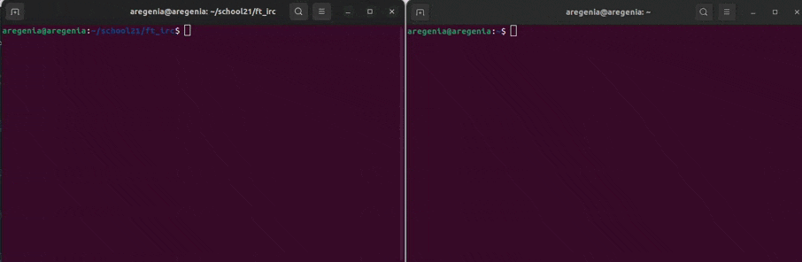

# ft_irc
<p>
  <b>Internet Relay Chat</b> or IRC is a text-based communication protocol on the Internet.
  It offers real-time messaging that can be either public or private. Users can exchange
  direct messages and join group channels.
</p>
The server is written according to the <a href="https://www.ietf.org/rfc/rfc1459.txt">rfc1459<a> standard.
<h3> Execute/Start Server </h3>

```
./ircserv <port> <password>
```

<ul>
  <li> port: The port number on which your IRC server will be listening to for incoming IRC connections. </li>
  <li> password: The connection password. It will be needed by any IRC client that tries to connect to your server. </li>
</ul>

<h3> Connect Client </h3>
After the server is started, clients can connect to it. On a local server, you can use:

```
nc localhost <port>
```


<h3> Mandatory conditions for user registration </h3>
<ul>
  <li>PASS-message</li>
  <li>NICK-message</li>
  <li>USER-message</li>
</ul>
<p>The PASS message should not be entered by the client last. If the registration is successful, a MOTD (message of the day) is sent to the client. </p>
  <h3> Processed commands </h3>
<ol>
  <lo>Connection registration
    <ul>
      <li>PASS</li>
      <li>NICK</li>
      <li>USER</li>
      <li>OPER</li>
      <li>QUIT</li>
    </ul>
  </lo>
  <lo>Users
    <ul>
      <li>PRIVMSG</li>
      <li>AWAY</li>
      <li>NOTICE</li>
      <li>WHO</li>
      <li>WHOIS</li>
      <li>WHOWAS</li>
    </ul>
  </lo>
  <lo>Channels
    <ul>
      <li>MODE</li>
      <li>TOPIC</li>
      <li>JOIN</li>
      <li>INVITE</li>
      <li>KICK</li>
      <li>PART</li>
      <li>NAMES</li>
      <li>LIST</li>
    </ul>
  </lo>
  <lo>Other
    <ul>
      <li>WALLOPS</li>
      <li>PING / PONG</li>
      <li>ISON</li>
      <li>USERHOST</li>
      <li>VERSION</li>
      <li>INFO</li>
      <li>ADMIN</li>
      <li>TIME</li>
    </ul>
  </lo>
</ol>
